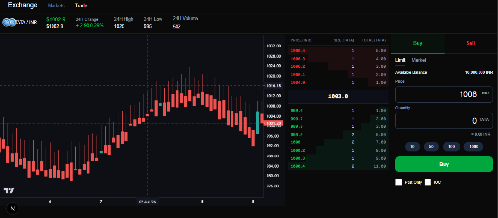

# CEX Exchange



A high-performance, real-time Cryptocurrency Exchange platform featuring a low-latency matching engine, real-time orderbooks via WebSockets, database-backed historical price candles, and a beautiful, premium trading user interface.

## Architecture

This project is built using a microservices-based architecture to achieve high scalability and performance:

- **Frontend**: Next.js 16 app styling with Tailwind CSS, utilizing Lightweight Charts for beautiful price indicators and WebSockets for real-time orderbook updates.
- **API Server**: Express backend managing client queries, HTTP endpoints for tickers, trades, and order actions.
- **Matching Engine**: In-memory, high-speed matching engine written in TypeScript executing trades and order matches in sub-milliseconds.
- **WebSocket Server**: Scalable WS gateway broadcasting real-time depth, trade, and ticker update notifications to subscribers.
- **DB Processor**: High-frequency database writer listening to trade updates via Redis and persistently storing price records to TimescaleDB.
- **Market Maker**: Background price and volume simulation bot creating organic market liquidity.

## Setup and Running

1. **Start Services (Docker)**:
   Ensure TimescaleDB and Redis containers are running in the docker directory:
   ```bash
   docker compose up -d
   ```

2. **Initialize Databases**:
   Re-seed the database:
   ```bash
   cd db
   bun run src/seed-db.ts
   ```

3. **Start the Microservices**:
   Run individual microservices:
   ```bash
   bun run dev
   ```
